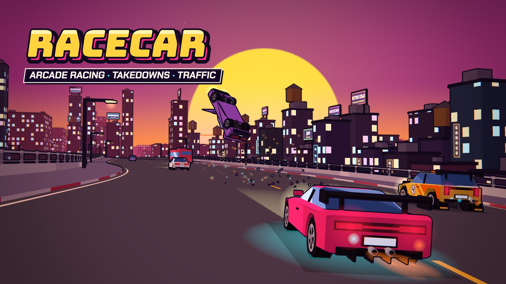

# racecar

A cel-shaded arcade street racer for the browser: Burnout 3's crashes, Mario Kart's party, and up
to 8 players online through [GameRelay](https://gamerelay.io). It's also GameRelay's example game:
everything online in it is built on the public SDK, and it's all here to read.

**[Play it](https://asleepace.com/games/Z442EE)** · [what's new](./CHANGELOG.md) · [the docs](./docs/README.md)



Seven maps (Downtown, Backroads, Paradise, Avalanche, Riviera, Sahara and Splash City) and 8 cars,
against up to 7 AI drivers or other players, with traffic, hazards (log trucks, falling signs,
volcano bombs, coconuts, an avalanche), rain, shortcuts, takedowns, near misses and drifting. On
Splash City it's a getaway: the heat rises and more cops join the chase, and online everyone flees the same city and
the longest run wins.

## Run it

```sh
bun install
bun run dev        # http://localhost:5178
```

Online lobbies need a GameRelay server. In dev, `.env.development` points at a local one
(`http://localhost:8787`, dev key `gr_pub_dev`). Open two tabs to play against yourself: each tab
is its own player. Without a server, the title says it can't reach the lobby server, and your own
lobby (you and the AIs) still works.

| | Keyboard | Gamepad |
|---|---|---|
| Drive | WASD / arrows | left stick, RT, LT |
| Drift | hold Shift while steering | RB (or X) |
| Boost | Space | A |
| Look back / reset | C / R | B / Y |
| Horn | H | left stick (press) |
| Pause (the controls are listed there) | Esc | Start |
| Sound · music · track | M · N · − + | |
| Felt wrong? (saves the last 30 s) | F8 | Select + Start |
| Ink outlines on / off | F6 | |
| Editor (dev) · debug · tuning | \` · F2 · F4 | |

## How online works

Each lobby is a GameRelay room. The race in it uses the room's **entities**: objects with typed
fields that the SDK syncs to everyone about 30 times a second and shows smoothed, about 100 ms in
the past. Every car in the race is one of two kinds of entity.

**Your car is yours.** After each step of the simulation, your page writes your car's pose into
its entity. Before each step, every other player's car is put where their entity says, predicted
forward to now. Your sim never wrecks someone else's car: the victim's own screen decides, and
tells you whose takedown it was. That's [`src/net/cars.ts`](./src/net/cars.ts), trimmed:

```ts
this.kind = room.define('car', { ...CAR_FIELDS, ...RUN_FIELDS }, { rate: CAR_RATE });
this.mine = this.kind.spawn(this.fields());          // once, on joining the race
// before each step: everyone else's car where they are now
for (const e of this.kind.all()) if (!e.mine) this.sim.setPose(i, predict(e, lead));
```

**The AIs and the cops are the host's.** The room has one host, picked by the server, and it moves
by itself when that player leaves or drops. The host drives every AI driver and every cop, and
writes them as **host entities**: spawned with `{ owner: 'host' }`, they belong to the role, not
the player, so when the role moves, the next host carries on writing the same entities. That
works because the AI keeps almost nothing but its car's pose. The new host reads where each car
is and drives it on from there. Until the host's entities arrive, every screen drives them itself
from the same start, so nobody sees a frozen grid. In outline:

```ts
beforeStep() {
  if (room.isHost) { /* yours: your sim drives them */ return; }
  for (const e of theirs) sim.setPose(i, predict(e, lead));      // put them where the host says
}
afterStep() {
  if (!room.isHost) return;
  for (const [seat, i] of seats) e = bySeat.get(seat) ?? kind.spawn(fields, { owner: 'host' });
}
```

That's [`src/net/rivals.ts`](./src/net/rivals.ts) for the AIs and
[`src/net/cops.ts`](./src/net/cops.ts) for the cops, the same pattern twice. Read them first if
you're building something on GameRelay.

The rest follows from that split:

- **One clock.** The lights go green at a time on the server's clock, and traffic, weather and
  hazards are functions of race time, so they're the same everywhere without being sent
  ([`clock.ts`](./src/net/clock.ts)).
- **Claims for shared things.** Whoever hits a traffic car claims it (`room.claim`, which exactly
  one player wins), and everyone wrecks it from the winner's time ([`traffic.ts`](./src/net/traffic.ts)).
- **Messages for contact.** Bumps and takedown credit are events between two players' pages, and
  each is checked: a bump only from the owner of the car that made it
  ([`contact.ts`](./src/net/contact.ts), [`wire.ts`](./src/net/wire.ts)).
- **The lobby is the room's state**, changed only by actions the host applies with one pure
  function ([`src/lobby/lobby.ts`](./src/lobby/lobby.ts)).

Players connect peer to peer where they can, and through a relay where they can't. The whole
picture, lobbies included, is [docs/ONLINE.md](./docs/ONLINE.md). Online play is party-grade:
the room's host is trusted, and a modified client could cheat.

## Making things

- **A map or a layout:** [docs/MAPS.md](./docs/MAPS.md). Press \` in the dev build for the editor:
  drag control points, set width, lanes, height and bank per point, **P** to drive from the cursor,
  ⌘S to save into `content/maps/<map>/<layout>.track.json`. Problems show on the map as you edit.
- **A car:** [docs/CARS.md](./docs/CARS.md), and the garage at `/cars.html`.
- **Anything else:** [CONTRIBUTING.md](./CONTRIBUTING.md).

Starting a race writes it into the URL
(`?mode=race&map=downtown/downtown&car=hatch&paint=0&seats=pnnnnnnn&laps=2&weather=random&time=random&mayhem=normal&traffic=1&seed=…`),
so any race can be shared or replayed: `seats` is one letter a seat (`p` you, `e`/`n`/`h` an easy,
normal or hard AI, `o` open, `x` closed). `?start=getaway` goes straight into a getaway. Add
`&post=0` (no post pass), `&ink=0` (no outlines) or `&trace=1` (a per-tick trace of your car).

## Layout

- `src/core`: the simulation. Plain TypeScript, no Three.js, no DOM, no network (a test enforces
  it), so the same code runs in the browser, the tests and the tools. Fixed 60 Hz steps, seeded.
- `src/net`: the online race (above). `src/lobby`: lobbies as GameRelay rooms, parties for P2P,
  pings and presence.
- `src/render` draws it with Three.js; `src/audio` synthesizes the sound and plays the music;
  `src/ui` is the HUD and menus; `src/input` keyboard and pads; `src/editor` the track editor;
  `src/telemetry` sessions and F8 reports; `src/viewer` the garage.
- `content/`: cars, paints, surfaces and maps, as JSON.
- `tools/`: validation, the AI lap report, replaying F8 reports, the map generators.
- `test/`: `bun run test`.

## Checks and telemetry

```sh
bun run test                    # the tests (physics, tracks, determinism, online, UI)
bun run typecheck
bun tools/validate.ts --ai      # every layout checked, and an AI must finish it
bun run build
```

CI runs all four. Dev builds also write events to `telemetry/<day>/<session>.jsonl` (gitignored);
`bun tools/telemetry.ts` sums up the latest session, and `bun tools/replay.ts` re-runs the latest
F8 report headless.

Released builds can send anonymous gameplay events (laps, wrecks, frame times; a random id, no
names) to PostHog, only when built with a key. Players can turn it off in Settings → Privacy.

## License

The code is [MIT](./LICENSE). The music in `public/music/` is © Colin, all rights reserved: it
plays as part of racecar, but isn't free to reuse on its own ([its license](./public/music/LICENSE)).
